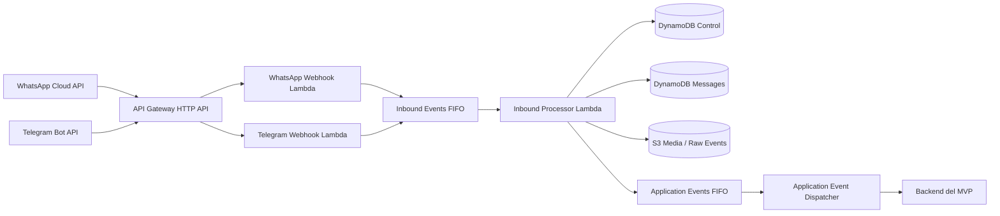
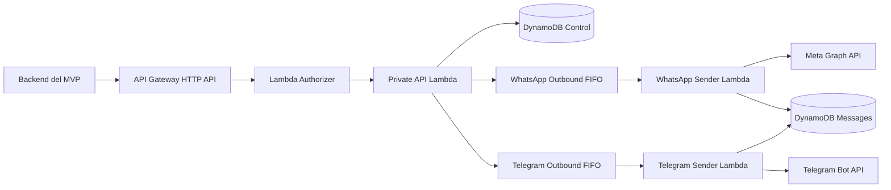

# Tinkiva Messaging Gateway

> Especificación de arquitectura e implementación para un servicio multicanal reutilizable por
> varios MVP.
>
> **Canales iniciales:** WhatsApp Cloud API y Telegram Bot API  
> **Infraestructura:** AWS API Gateway, Lambda, SQS, DynamoDB, S3 y Secrets Manager  
> **Fecha de la especificación:** 24 de julio de 2026  
> **Estado:** lista para ser entregada a un agente de desarrollo

---

## 1. Objetivo

Construir un servicio independiente y reutilizable que permita a distintas aplicaciones de Tinkiva:

- Conectar uno o varios números de WhatsApp Cloud API.
- Conectar uno o varios bots de Telegram.
- Recibir mensajes, estados y archivos.
- Enviar mensajes por cualquiera de los canales soportados.
- Consultar conversaciones e historial.
- Recibir eventos normalizados sin conocer los payloads específicos de Meta o Telegram.
- Compartir la misma plataforma de mensajería sin compartir credenciales ni datos entre
  aplicaciones.

Las aplicaciones consumidoras pueden ser Storagia, PsiAgenda u otros MVP futuros. El gateway no debe
contener reglas de inventario, ventas, citas, psicología ni lógica específica de un producto.

---

## 2. Decisiones obligatorias

1. **El servicio será un proyecto y despliegue independiente.** No se implementará dentro del
   monolito de Storagia.
2. **El gateway no se conectará a las bases PostgreSQL de los MVP.** Cada aplicación conserva la
   propiedad de sus datos comerciales.
3. **Cada aplicación conserva su `Account.id` local.** No se reemplazará por `MVP_NAME + ID`.
4. El gateway generará su propio `tenantId` global y mantendrá el vínculo único:

   ```text
   applicationId + externalAccountId -> tenantId
   ```

5. Las aplicaciones nunca recibirán ni consultarán los tokens de Meta o Telegram después del alta de
   una integración.
6. Los frontends nunca llamarán al gateway con credenciales de servicio. Todas las llamadas se harán
   desde el backend de cada MVP.
7. El teléfono y el username de WhatsApp no serán claves primarias del contacto. Se soportarán
   BSUID, número, username y futuros identificadores.
8. Se utilizarán colas SQS FIFO para preservar el orden por conversación.
9. Todos los consumidores de SQS y webhooks serán idempotentes.
10. Los archivos se almacenarán en S3; no se guardarán binarios en DynamoDB ni SQS.
11. La primera versión soportará **WhatsApp Cloud API oficial**. Baileys no formará parte de las
    Lambdas; si se agrega posteriormente, deberá ejecutarse como proceso persistente en EC2/ECS y
    publicar en las mismas colas.
12. Ningún agente debe hacer `commit`, `merge`, `rebase` o `push` sin autorización explícita.

---

## 3. Separación entre proyectos y cuentas

Actualmente existe una instancia PostgreSQL en EC2 con bases diferentes, por ejemplo:

```text
PostgreSQL EC2
├── storagia
├── psiagenda
├── dialogia
└── otro_mvp
```

Esto no cambia. Cada base puede tener su propio modelo `Account` y sus propias migraciones.

### 3.1 No concatenar el nombre del MVP con el UUID

No hacer esto como identificador principal:

```text
STORAGIA_3fa85f64-5717-4562-b3fc-2c963f66afa6
PSIAGENDA_3fa85f64-5717-4562-b3fc-2c963f66afa6
```

La concatenación puede utilizarse únicamente como etiqueta de depuración:

```text
sourceKey = "STORAGIA:3fa85f64-5717-4562-b3fc-2c963f66afa6"
```

No debe ser el `tenantId`, porque:

- Acopla el servicio de mensajería al nombre actual del producto.
- Complica renombrar un MVP.
- Expone identificadores internos en logs y URLs.
- Dificulta vincular una misma empresa a más de una aplicación.
- Mezcla el espacio de identidad local con el global.

### 3.2 Identidad recomendada

Ejemplo:

```json
{
  "applicationCode": "STORAGIA",
  "externalAccountId": "3fa85f64-5717-4562-b3fc-2c963f66afa6",
  "externalAccountCode": "MADELU",
  "tenantId": "9a246e22-3b47-4ecf-bff2-35869af23784"
}
```

Reglas:

- `applicationCode`: identifica el producto, no al cliente.
- `externalAccountId`: es el `Account.id` de la base local del producto.
- `externalAccountCode`: es informativo y puede cambiar.
- `tenantId`: UUID generado por el gateway y utilizado en todas sus APIs.
- La unicidad real será `(applicationId, externalAccountId)`.
- Dos proyectos pueden tener accidentalmente el mismo UUID local sin colisionar.

### 3.3 ¿Se debe copiar el mismo modelo `Account` en todos los MVP?

Se puede conservar una estructura conceptual parecida, pero el gateway no debe exigir que todos los
productos tengan exactamente la misma tabla.

Cada aplicación solo debe poder mapear su organización a este contrato:

```ts
export interface ExternalTenantReference {
  externalAccountId: string;
  externalAccountCode?: string;
  name: string;
  metadata?: Record<string, string | number | boolean | null>;
}
```

Por tanto:

- Storagia puede usar `Account`.
- Otro producto podría usar `Organization`, `Workspace`, `Clinic` o `Company`.
- Todos envían un `externalAccountId` estable como texto.
- El gateway nunca presupone que el ID externo es necesariamente UUID.

### 3.4 Misma empresa usando dos aplicaciones

Por defecto, cada combinación aplicación/cuenta crea un tenant separado:

```text
STORAGIA + Account A -> Tenant 1
PSIAGENDA + Account B -> Tenant 2
```

No se fusionarán automáticamente por nombre, RUC, correo, teléfono o código.

Si en el futuro la misma empresa debe compartir integraciones entre dos aplicaciones, un
administrador de plataforma podrá crear un segundo vínculo explícito:

```text
Tenant 1
├── STORAGIA + Account A
└── OTRO_MVP + Account B
```

Cada aplicación recibirá únicamente los eventos a los que esté suscrita. La vinculación cruzada
requerirá permiso de plataforma y auditoría.

---

## 4. Modelo local recomendado en cada PostgreSQL

No modificar el tipo de `Account.id`. Agregar una tabla de vínculo independiente.

```prisma
model Account {
  id        String   @id @default(uuid()) @db.Uuid
  code      String   @unique @db.VarChar(60)
  name      String   @db.VarChar(160)
  createdAt DateTime @default(now())
  updatedAt DateTime @updatedAt

  stores              Store[]
  categories          Category[]
  colors               Color[]
  sizeScales           SizeScale[]
  products             Product[]
  productVariants      ProductVariant[]
  inventoryLocations   InventoryLocation[]
  inventoryOperations  InventoryOperation[]
  auditLogs            AuditLog[]

  messagingTenantLink MessagingTenantLink?

  @@map("accounts")
}

model MessagingTenantLink {
  id                 String                    @id @default(uuid()) @db.Uuid
  accountId          String                    @unique @db.Uuid
  applicationCode    String                    @db.VarChar(60)
  messagingTenantId  String?                   @unique @db.Uuid
  status              MessagingTenantLinkStatus @default(PENDING)
  lastSyncError       String?                   @db.VarChar(500)
  lastSyncAt          DateTime?
  createdAt           DateTime                  @default(now())
  updatedAt           DateTime                  @updatedAt

  account Account @relation(fields: [accountId], references: [id], onDelete: Cascade)

  @@unique([applicationCode, accountId])
  @@index([status])
  @@map("messaging_tenant_links")
}

enum MessagingTenantLinkStatus {
  PENDING
  ACTIVE
  SUSPENDED
  ERROR
  DISCONNECTED
}
```

### 4.1 Flujo al crear una cuenta local

No hacer una transacción distribuida entre PostgreSQL y el gateway.

Flujo recomendado:

1. Crear `Account` en la transacción local.
2. Crear `MessagingTenantLink` con estado `PENDING` en la misma transacción.
3. Confirmar la transacción de PostgreSQL.
4. Ejecutar `ensureMessagingTenant(accountId)`.
5. El gateway crea o devuelve el mismo tenant gracias a la idempotencia.
6. Guardar `messagingTenantId` y cambiar el estado a `ACTIVE`.
7. Si el gateway no responde, conservar `PENDING` o `ERROR` y reintentar.

La creación de una cuenta comercial no debe fallar solo porque el servicio de mensajería esté
temporalmente indisponible.

### 4.2 Alta perezosa para el MVP

También es válido registrar el tenant únicamente cuando el usuario abre por primera vez la
configuración de WhatsApp o Telegram:

```ts
await messagingTenantService.ensureForAccount(accountId);
```

El endpoint del gateway será idempotente, por lo que esta llamada puede repetirse de forma segura.

---

## 5. Vocabulario del dominio

| Concepto             | Significado                                                 |
| -------------------- | ----------------------------------------------------------- |
| `Application`        | Producto consumidor, por ejemplo `STORAGIA` o `PSIAGENDA`.  |
| `ApplicationClient`  | Credencial máquina-a-máquina de una aplicación.             |
| `Tenant`             | Organización global dentro del gateway.                     |
| `AppTenantLink`      | Relación entre una cuenta local y un tenant global.         |
| `ProviderConnection` | Conjunto cifrado de credenciales de Meta o Telegram.        |
| `ChannelIntegration` | Número de WhatsApp o bot de Telegram conectado a un tenant. |
| `ContactIdentity`    | Identidad externa de una persona en un canal.               |
| `Conversation`       | Hilo entre una integración y una identidad externa.         |
| `Message`            | Mensaje normalizado entrante o saliente.                    |
| `EventEndpoint`      | Webhook de una aplicación para recibir eventos del gateway. |

---

## 6. Arquitectura general

### 6.1 Mensajes entrantes



### 6.2 Mensajes salientes



### 6.3 Principio de responsabilidad

El gateway sí conoce:

- Formatos de Meta y Telegram.
- Tokens y secretos de proveedores.
- BSUID, número, username, `chat_id`, `user_id` y mensajes.
- Reintentos, rate limits, estados y archivos.

El gateway no conoce:

- Productos o inventario.
- Pedidos, citas, pacientes o historias clínicas.
- Usuarios internos y roles de cada MVP.
- Reglas de negocio de cada aplicación.

---

## 7. Lambdas del MVP

| Función                | Responsabilidad                                                           |
| ---------------------- | ------------------------------------------------------------------------- |
| `auth-token`           | Validar `clientId/clientSecret` y emitir JWT corto.                       |
| `api-authorizer`       | Validar JWT, estado del cliente y scopes.                                 |
| `private-api`          | Tenants, integraciones, mensajes, conversaciones y endpoints.             |
| `whatsapp-webhook`     | Verificar Meta, deduplicar de forma preliminar y encolar.                 |
| `telegram-webhook`     | Verificar Telegram, deduplicar de forma preliminar y encolar.             |
| `inbound-processor`    | Normalizar, resolver identidad/conversación, persistir y publicar evento. |
| `whatsapp-sender`      | Enviar a Meta y actualizar estado.                                        |
| `telegram-sender`      | Enviar a Telegram y actualizar estado.                                    |
| `app-event-dispatcher` | Firmar y entregar eventos al backend consumidor.                          |
| `media-worker`         | Descargar/subir archivos y actualizar metadatos.                          |
| `admin-api` o CLI      | Registrar aplicaciones, clientes y vínculos privilegiados.                |

Para el MVP, `private-api` y `admin-api` pueden compartir código, pero las rutas administrativas
deben exigir un scope o authorizer distinto.

---

## 8. Colas SQS

### 8.1 Colas requeridas

```text
messaging-inbound-events-{stage}.fifo
messaging-inbound-events-dlq-{stage}.fifo

messaging-outbound-whatsapp-{stage}.fifo
messaging-outbound-whatsapp-dlq-{stage}.fifo

messaging-outbound-telegram-{stage}.fifo
messaging-outbound-telegram-dlq-{stage}.fifo

messaging-app-events-{stage}.fifo
messaging-app-events-dlq-{stage}.fifo

messaging-media-{stage}
messaging-media-dlq-{stage}
```

La cola de multimedia puede ser Standard porque no necesita bloquear la secuencia conversacional.
Las demás serán FIFO.

### 8.2 Agrupación y orden

Para mensajes entrantes y salientes:

```text
MessageGroupId = integrationId + ":" + conversationKey
```

`conversationKey` será:

- WhatsApp: BSUID cuando exista; número como fallback temporal.
- Telegram: `chat.id`.

Para eventos enviados a las aplicaciones:

```text
MessageGroupId = applicationId + ":" + tenantId + ":" + conversationId
```

Así se conserva el orden dentro de una conversación y se procesan distintas conversaciones en
paralelo.

### 8.3 Deduplicación

No depender únicamente de la ventana de deduplicación de SQS FIFO.

```text
MessageDeduplicationId = hash(provider + integrationId + providerEventId)
```

Para comandos salientes:

```text
MessageDeduplicationId = internalMessageId
```

Además se creará un registro de idempotencia duradero en DynamoDB con escritura condicional.

### 8.4 Configuración inicial

- `ContentBasedDeduplication`: `false`.
- `batchSize`: `10` para FIFO.
- `functionResponseType`: `ReportBatchItemFailures`.
- `maxReceiveCount`: `5`.
- Retención de colas origen: `4 días`.
- Retención de DLQ: `14 días`.
- `visibilityTimeout`: mínimo seis veces el timeout de la Lambda consumidora, más la ventana de
  batching cuando corresponda.
- Activar alarmas cuando una DLQ tenga uno o más mensajes.
- Mantener los cuerpos internos por debajo de `128 KB`, aunque SQS soporte tamaños superiores.
- Guardar payloads grandes o crudos en S3 y enviar solo su referencia.
- Nunca incluir tokens, secretos o credenciales en el cuerpo o atributos de SQS.

### 8.5 Contrato de evento interno

```ts
export interface QueueEnvelope<T> {
  schemaVersion: 1;
  eventId: string;
  eventType: string;
  occurredAt: string;
  correlationId: string;
  causationId?: string;
  applicationId?: string;
  tenantId?: string;
  integrationId?: string;
  payload: T;
}
```

---

## 9. DynamoDB

Se utilizarán dos tablas para separar el plano de control del historial de alto volumen.

### 9.1 Tabla de control

```text
messaging-control-{stage}
```

Configuración:

- Billing mode: `PAY_PER_REQUEST`.
- Partition key: `PK`.
- Sort key: `SK`.
- GSI1: `GSI1PK` + `GSI1SK`.
- Point-in-time recovery habilitado en producción.
- Cifrado en reposo habilitado.
- TTL en atributo `expiresAt`.
- Sin LSI.

Entidades:

- Application.
- ApplicationClient.
- Tenant.
- AppTenantLink.
- ProviderConnection.
- ChannelIntegration.
- ContactIdentity y aliases.
- Conversation.
- EventEndpoint.
- IdempotencyRecord.
- Webhook lookup.

### 9.2 Tabla de mensajes

```text
messaging-data-{stage}
```

Configuración:

- Billing mode: `PAY_PER_REQUEST`.
- Partition key: `PK`.
- Sort key: `SK`.
- GSI1 opcional para exportación por tenant y mes.
- Point-in-time recovery habilitado en producción.
- TTL opcional y configurable para mensajes.
- Ningún ítem normalizado deberá superar `300 KB`.

Entidades:

- Message.
- MessagePointer.
- ProviderMessagePointer.
- MessageStatusHistory.
- RawEventPointer.

### 9.3 Claves de la tabla de control

#### Application

```json
{
  "PK": "APP#app_01",
  "SK": "META",
  "entityType": "APPLICATION",
  "code": "STORAGIA",
  "name": "Storagia",
  "status": "ACTIVE",
  "GSI1PK": "APP_CODE#STORAGIA",
  "GSI1SK": "APP#app_01"
}
```

#### ApplicationClient

```json
{
  "PK": "CLIENT#msgc_01",
  "SK": "META",
  "entityType": "APPLICATION_CLIENT",
  "applicationId": "app_01",
  "secretDigest": "<HMAC-SHA256>",
  "scopes": ["tenants:write", "integrations:write", "messages:send", "messages:read"],
  "status": "ACTIVE",
  "GSI1PK": "APP#app_01",
  "GSI1SK": "CLIENT#msgc_01"
}
```

#### Tenant

```json
{
  "PK": "TENANT#tenant_01",
  "SK": "META",
  "entityType": "TENANT",
  "name": "Corporación Madelu",
  "status": "ACTIVE",
  "createdAt": "2026-07-24T23:00:00.000Z"
}
```

#### Vínculo por cuenta externa

```json
{
  "PK": "APP#app_01",
  "SK": "ACCOUNT#3fa85f64-5717-4562-b3fc-2c963f66afa6",
  "entityType": "APP_TENANT_LINK",
  "tenantId": "tenant_01",
  "externalAccountId": "3fa85f64-5717-4562-b3fc-2c963f66afa6",
  "externalAccountCode": "MADELU",
  "role": "OWNER",
  "status": "ACTIVE"
}
```

Crear también el vínculo inverso en la misma transacción:

```json
{
  "PK": "TENANT#tenant_01",
  "SK": "APP#app_01#ACCOUNT#3fa85f64-5717-4562-b3fc-2c963f66afa6",
  "entityType": "TENANT_APP_LINK",
  "applicationId": "app_01",
  "externalAccountId": "3fa85f64-5717-4562-b3fc-2c963f66afa6"
}
```

#### ProviderConnection

```json
{
  "PK": "PROVIDER_CONNECTION#pc_01",
  "SK": "META",
  "entityType": "PROVIDER_CONNECTION",
  "provider": "WHATSAPP",
  "scope": "TENANT",
  "tenantId": "tenant_01",
  "credentialRef": "pc_01",
  "credentialStorage": "DYNAMODB_KMS",
  "webhookKey": "<32-byte-random-token>",
  "status": "ACTIVE"
}
```

La credencial vive en un item separado y cifrado por la aplicación:

```json
{
  "PK": "PROVIDER_CONNECTION#pc_01",
  "SK": "CREDENTIAL",
  "entityType": "PROVIDER_CREDENTIAL",
  "provider": "WHATSAPP",
  "credentialCiphertext": "<base64-kms-ciphertext>",
  "credentialKeyArn": "<stage-kms-key-arn>",
  "credentialVersion": 1
}
```

Nunca incluir tokens o secretos en texto plano dentro del item.

#### ChannelIntegration

```json
{
  "PK": "INTEGRATION#int_01",
  "SK": "META",
  "entityType": "CHANNEL_INTEGRATION",
  "tenantId": "tenant_01",
  "providerConnectionId": "pc_01",
  "provider": "WHATSAPP",
  "providerAccountId": "<phone-number-id>",
  "providerBusinessId": "<waba-id>",
  "displayName": "WhatsApp Tienda Principal",
  "status": "ACTIVE"
}
```

Ítem adicional para listar integraciones del tenant:

```text
PK = TENANT#tenant_01
SK = INTEGRATION#WHATSAPP#int_01
```

Lookup rápido de webhooks de WhatsApp:

```text
PK = WHATSAPP_PHONE_NUMBER#<phone-number-id>
SK = REF
```

Lookup de webhook por ruta:

```text
PK = WEBHOOK#WHATSAPP#<webhook-key>
SK = REF
```

#### Identidad

```json
{
  "PK": "IDENTITY#identity_01",
  "SK": "META",
  "entityType": "CONTACT_IDENTITY",
  "integrationId": "int_01",
  "canonicalType": "WHATSAPP_BSUID",
  "canonicalValue": "US.1234567890",
  "phoneE164": null,
  "username": "cliente_demo",
  "displayName": "Cliente Demo"
}
```

Crear aliases separados para cada identificador disponible:

```text
PK = INTEGRATION#int_01
SK = IDENTITY_KEY#WHATSAPP_BSUID#<sha256-normalized-value>

PK = INTEGRATION#int_01
SK = IDENTITY_KEY#WHATSAPP_PHONE#<sha256-normalized-value>
```

El alias apunta al mismo `identityId`. Nunca usar el username como alias permanente sin guardar que
es mutable.

#### Conversation

```json
{
  "PK": "CONVERSATION#conv_01",
  "SK": "META",
  "entityType": "CONVERSATION",
  "tenantId": "tenant_01",
  "integrationId": "int_01",
  "identityId": "identity_01",
  "status": "OPEN",
  "lastMessageAt": "2026-07-24T23:10:00.000Z",
  "GSI1PK": "TENANT#tenant_01",
  "GSI1SK": "CONVERSATION#2026-07-24T23:10:00.000Z#conv_01"
}
```

Lookup único por integración e identidad:

```text
PK = INTEGRATION#int_01
SK = CONVERSATION_BY_IDENTITY#identity_01
```

#### IdempotencyRecord

```json
{
  "PK": "IDEMPOTENCY#COMMAND#app_01#<sha256-key>",
  "SK": "LOCK",
  "entityType": "IDEMPOTENCY",
  "status": "ENQUEUED",
  "resourceId": "msg_01",
  "requestHash": "<sha256-canonical-body>",
  "expiresAt": 1784934000
}
```

Si la misma clave se reutiliza con un cuerpo distinto, responder `409 IDEMPOTENCY_KEY_REUSED`.

### 9.4 Claves de la tabla de mensajes

#### Mensaje por conversación

```json
{
  "PK": "CONVERSATION#conv_01",
  "SK": "MESSAGE#2026-07-24T23:10:00.000Z#01J...",
  "entityType": "MESSAGE",
  "messageId": "msg_01",
  "tenantId": "tenant_01",
  "integrationId": "int_01",
  "provider": "WHATSAPP",
  "direction": "INBOUND",
  "providerMessageId": "wamid...",
  "type": "TEXT",
  "text": "Hola, ¿tienen stock?",
  "status": "RECEIVED",
  "occurredAt": "2026-07-24T23:10:00.000Z"
}
```

#### Puntero por ID interno

```text
PK = MESSAGE#msg_01
SK = REF
```

Debe contener `conversationId` y la sort key del mensaje.

#### Puntero por ID del proveedor

```text
PK = PROVIDER_MESSAGE#WHATSAPP#int_01#<sha256-provider-message-id>
SK = REF
```

Permite encontrar el mensaje cuando llega un estado `delivered`, `read` o `failed`.

### 9.5 Escrituras atómicas

Utilizar `TransactWriteItems` y condiciones para:

- Crear tenant y ambos vínculos de aplicación.
- Crear identidad más aliases.
- Crear conversación más lookup único.
- Crear mensaje más puntero interno y puntero del proveedor.
- Aplicar un estado sin retroceder la máquina de estados.

No utilizar `Scan` en rutas normales. Todas las listas deben usar `Query` y cursor opaco.

---

## 10. Credenciales y autenticación

Existen tres flujos de seguridad distintos. No deben mezclarse.

```text
A. Backend del MVP -> Messaging Gateway
B. Messaging Gateway -> Meta / Telegram
C. Messaging Gateway -> webhook del backend del MVP
```

### 10.1 A. Backend del MVP hacia el gateway

No utilizar una API key de API Gateway como mecanismo de autenticación. Se implementará
autenticación máquina-a-máquina propia con credenciales de cliente y JWT de corta duración.

#### Alta de una aplicación

Un comando administrativo crea:

```text
Application:
  applicationId = app_01
  code = STORAGIA

ApplicationClient:
  clientId = msgc_01
  clientSecret = msgs_<random-256-bits>
```

El `clientSecret` se muestra una sola vez.

El gateway almacena únicamente:

```text
secretDigest = HMAC-SHA256(authPepper, clientSecret)
```

`authPepper` vive en Secrets Manager y no en DynamoDB.

#### Intercambio por token

```http
POST /v1/auth/token
Content-Type: application/json
```

```json
{
  "clientId": "msgc_01",
  "clientSecret": "msgs_..."
}
```

Respuesta:

```json
{
  "accessToken": "<jwt>",
  "tokenType": "Bearer",
  "expiresIn": 900
}
```

Claims mínimos:

```json
{
  "iss": "https://messaging-api.tinkiva.com",
  "aud": "tinkiva-messaging-gateway",
  "sub": "app_01",
  "client_id": "msgc_01",
  "scope": "tenants:write integrations:write messages:send messages:read events:manage",
  "jti": "<ulid>",
  "iat": 1784934000,
  "exp": 1784934900
}
```

Reglas:

- Duración inicial: 15 minutos.
- El SDK reutiliza el token y lo renueva 60 segundos antes de expirar.
- El `applicationId` se obtiene del token; no se confía en un campo enviado en el body.
- El authorizer comprueba que `ApplicationClient` y `Application` sigan activos.
- Todos los endpoints validan que la aplicación tenga un `AppTenantLink` activo para el `tenantId`
  solicitado.
- Un tenant UUID por sí solo no concede acceso.

Scopes iniciales:

```text
tenants:read
tenants:write
integrations:read
integrations:write
messages:read
messages:send
events:manage
platform:admin
```

#### Dónde guardar la credencial en los MVP de la EC2

Variables no sensibles:

```env
MESSAGING_GATEWAY_URL=https://messaging-api.tinkiva.com
MESSAGING_CLIENT_ID=msgc_01
```

El secreto no debe guardarse en la base de datos, el repositorio ni el frontend.

Opción recomendada para el MVP actual en una EC2 compartida:

```text
/run/secrets/storagia/messaging-client-secret
/run/secrets/psiagenda/messaging-client-secret
/run/secrets/otro-mvp/messaging-client-secret
```

Permisos:

```bash
sudo chown storagia:storagia /run/secrets/storagia/messaging-client-secret
sudo chmod 0400 /run/secrets/storagia/messaging-client-secret
```

Cada aplicación debe ejecutarse con un usuario Linux o contenedor distinto y leer únicamente su
archivo.

```env
MESSAGING_CLIENT_SECRET_FILE=/run/secrets/storagia/messaging-client-secret
```

Secrets Manager puede ser la fuente maestra durante el despliegue, pero una única instancia EC2
comparte el mismo instance role. Ese role no ofrece aislamiento fuerte entre procesos del mismo
host. Para aislamiento real en producción, mover cada aplicación a una tarea ECS/Fargate con su
propio task role o a instancias separadas.

No usar un único archivo `.env` compartido para los cuatro proyectos.

#### Rotación

1. Crear un segundo `ApplicationClient`.
2. Instalar el nuevo secreto en la aplicación.
3. Desplegar o recargar el proceso.
4. Confirmar tráfico con el nuevo `clientId`.
5. Revocar el cliente anterior.
6. Registrar el cambio en auditoría.

### 10.2 B. Credenciales de Meta y Telegram

Las aplicaciones consumidoras no usarán directamente estas credenciales para enviar mensajes. Solo
el gateway las utilizará.

#### Alta manual del MVP

Durante la conexión de un canal, un backend autorizado enviará las credenciales una única vez por
HTTPS al endpoint de integración. El gateway debe:

1. Validar el formato.
2. Validar la credencial contra el proveedor.
3. Cifrar la credencial con la clave KMS del entorno y un contexto ligado a la conexión.
4. Guardar en DynamoDB solo el ciphertext, la versión y metadatos no sensibles.
5. Eliminar las credenciales de memoria después de la operación.
6. Redactarlas de todos los logs y errores.
7. Nunca devolverlas en la respuesta.

La aplicación que relayee el token durante el onboarding tampoco debe persistirlo ni registrarlo.

Una evolución posterior puede alojar una pantalla de onboarding directamente en el gateway o
integrar Meta Embedded Signup para que el token no atraviese el backend del MVP.

#### Claves y registros

```text
KMS alias: alias/tinkiva-messaging-provider-credentials-{stage}
DynamoDB PK: PROVIDER_CONNECTION#{providerConnectionId}
DynamoDB SK: CREDENTIAL
Secrets Manager: /tinkiva/messaging/{stage}/auth/pepper
Secrets Manager: /tinkiva/messaging/{stage}/auth/jwt-signing
```

Se crea una clave KMS por entorno, no una clave por empresa. Cada conexión mantiene su propio item
cifrado; no se acumulan todas las empresas dentro de un único secreto o documento.

#### Secreto de WhatsApp

```json
{
  "accessToken": "...",
  "appSecret": "...",
  "verifyToken": "..."
}
```

Metadatos no secretos en DynamoDB:

```json
{
  "metaAppId": "...",
  "businessPortfolioId": "...",
  "wabaId": "...",
  "phoneNumberId": "...",
  "displayPhoneNumber": "+51 ...",
  "graphApiVersion": "<pinned-version>"
}
```

Una misma `ProviderConnection` de Meta puede atender varias integraciones/números. El webhook se
valida con el `appSecret` y luego se resuelve la integración mediante `phone_number_id`.

#### Secreto de Telegram

```json
{
  "botToken": "...",
  "webhookSecretToken": "..."
}
```

Metadatos no secretos:

```json
{
  "botId": "...",
  "botUsername": "..."
}
```

Al registrar el bot:

1. Ejecutar `getMe` para validar el token.
2. Generar `webhookKey` aleatorio para la URL.
3. Generar `webhookSecretToken` aleatorio.
4. Ejecutar `setWebhook` con ambos.
5. Guardar el ciphertext en el item `CREDENTIAL` y solo `credentialRef`, `botId`, `botUsername` y
   estado en los metadatos.

#### IAM de credenciales

- `private-api` puede escribir el item exacto y usar `kms:Encrypt` con la clave del entorno.
- Cada sender y webhook solo puede leer DynamoDB y usar `kms:Decrypt` con esa clave.
- Las Lambdas de proveedores no acceden a Secrets Manager.
- Los secretos de autenticación conservan permisos de Secrets Manager limitados a su ARN.
- Ninguna función tendrá `kms:*` ni `secretsmanager:*` sobre `*`.

### 10.3 C. Gateway hacia el webhook de cada aplicación

Cada aplicación registra un `EventEndpoint`:

```json
{
  "url": "https://api.storagia.com/integrations/messaging/events",
  "events": [
    "message.received",
    "message.sent",
    "message.delivered",
    "message.read",
    "message.failed"
  ]
}
```

El gateway genera un secreto de firma que se muestra una sola vez y se almacena por separado en
ambos lados.

Headers:

```http
X-Tinkiva-Event-Id: evt_01
X-Tinkiva-Timestamp: 1784934000
X-Tinkiva-Signature: v1=<hex-hmac-sha256>
Content-Type: application/json
```

Firma:

```text
signedPayload = timestamp + "." + rawRequestBody
signature = HMAC-SHA256(eventSigningSecret, signedPayload)
```

La aplicación receptora debe:

1. Leer el body crudo antes de transformarlo.
2. Comparar la firma en tiempo constante.
3. Rechazar timestamps con más de cinco minutos de diferencia.
4. Deduplicar por `X-Tinkiva-Event-Id`.
5. Responder `2xx` rápidamente.
6. Procesar su lógica comercial después de confirmar recepción.

La rotación de firma debe soportar `currentSecret` y `nextSecret` durante una ventana corta.

---

## 11. API pública y privada

Dominio propuesto:

```text
https://messaging-api.tinkiva.com
```

### 11.1 Rutas públicas controladas

```text
POST /v1/auth/token
GET  /webhooks/whatsapp/{webhookKey}
POST /webhooks/whatsapp/{webhookKey}
POST /webhooks/telegram/{webhookKey}
GET  /health
```

`/health` no debe exponer tablas, ARNs, secretos ni detalles internos.

### 11.2 Rutas privadas de aplicaciones

```text
POST   /v1/tenants
GET    /v1/tenants/by-external-account/{externalAccountId}
GET    /v1/tenants/{tenantId}
PATCH  /v1/tenants/{tenantId}

POST   /v1/tenants/{tenantId}/integrations/whatsapp
POST   /v1/tenants/{tenantId}/integrations/telegram
GET    /v1/tenants/{tenantId}/integrations
GET    /v1/integrations/{integrationId}
PATCH  /v1/integrations/{integrationId}
DELETE /v1/integrations/{integrationId}

POST   /v1/messages
GET    /v1/messages/{messageId}
GET    /v1/tenants/{tenantId}/conversations
GET    /v1/conversations/{conversationId}
GET    /v1/conversations/{conversationId}/messages

POST   /v1/event-endpoints
GET    /v1/event-endpoints
PATCH  /v1/event-endpoints/{endpointId}
DELETE /v1/event-endpoints/{endpointId}
```

### 11.3 Rutas privilegiadas

```text
POST /v1/admin/applications
POST /v1/admin/applications/{applicationId}/clients
POST /v1/admin/tenants/{tenantId}/links
POST /v1/admin/dlq/{queue}/redrive
POST /v1/admin/events/{eventId}/replay
```

Deben utilizar un authorizer y scopes administrativos distintos.

---

## 12. Contratos principales

### 12.1 Registrar o recuperar tenant

```http
POST /v1/tenants
Authorization: Bearer <access-token>
Idempotency-Key: tenant:3fa85f64-5717-4562-b3fc-2c963f66afa6
Content-Type: application/json
```

```json
{
  "externalAccountId": "3fa85f64-5717-4562-b3fc-2c963f66afa6",
  "externalAccountCode": "MADELU",
  "name": "Corporación Madelu",
  "metadata": {
    "country": "PE"
  }
}
```

Respuesta `201` la primera vez y `200` en repeticiones equivalentes:

```json
{
  "tenantId": "tenant_01",
  "externalAccountId": "3fa85f64-5717-4562-b3fc-2c963f66afa6",
  "status": "ACTIVE"
}
```

No se recibe `applicationId` en el body. Se obtiene del JWT.

### 12.2 Enviar por conversación existente

```http
POST /v1/messages
Authorization: Bearer <access-token>
Idempotency-Key: order-confirmed:order_123
```

```json
{
  "tenantId": "tenant_01",
  "integrationId": "int_01",
  "conversationId": "conv_01",
  "content": {
    "type": "TEXT",
    "text": {
      "body": "Tu pedido fue confirmado."
    }
  },
  "clientReferenceId": "order_123"
}
```

Respuesta `202 Accepted`:

```json
{
  "messageId": "msg_01",
  "status": "QUEUED",
  "idempotencyKey": "order-confirmed:order_123"
}
```

### 12.3 Enviar a una identidad conocida sin conversación

```json
{
  "tenantId": "tenant_01",
  "integrationId": "int_01",
  "recipient": {
    "type": "WHATSAPP_BSUID",
    "value": "US.1234567890"
  },
  "content": {
    "type": "TEXT",
    "text": {
      "body": "Hola"
    }
  }
}
```

Tipos iniciales de destinatario:

```ts
type RecipientType = "WHATSAPP_BSUID" | "WHATSAPP_PHONE" | "TELEGRAM_CHAT_ID";
```

El username no será un destino técnico estable.

### 12.3.1 Enviar imágenes

La API acepta una URL HTTPS pública y un texto opcional. Copia la imagen al bucket privado antes de
encolarla y usa `text` como caption nativo tanto en WhatsApp como en Telegram:

```json
{
  "tenantId": "tenant_01",
  "integrationId": "int_01",
  "conversationId": "conv_01",
  "content": {
    "type": "IMAGE",
    "media": {
      "url": "https://cdn.example.com/promocion.jpg",
      "text": "POLO PRUEBA"
    }
  }
}
```

WhatsApp presenta ese texto debajo de la imagen dentro de la misma burbuja. Telegram lo presenta
como caption de la foto. El frontend utiliza el mismo campo `text` sin importar el proveedor.
`caption` continúa aceptado como alias retrocompatible de `text`, pero no se pueden enviar ambos.

También se puede reutilizar una imagen ya almacenada pasando en `mediaId` la clave `tenants/...`
retornada por el gateway. Se debe enviar exactamente uno de `url` o `mediaId`.

Para WhatsApp, las imágenes deben ser JPEG o PNG y no superar 5 MB. El sender lee y valida el
binario desde la copia canónica almacenada en S3, lo sube al Media API de Meta, persiste el Media ID
devuelto para reutilizarlo en reintentos y finalmente envía `image.id` junto con el caption.
Telegram genera una URL prefirmada temporal al momento de procesar el mensaje.

### 12.3.2 Negrita y emojis

Los textos y captions aceptan la convención unificada `**texto en negrita**` para WhatsApp y
Telegram. El gateway la convierte al formato nativo de cada proveedor; el frontend no debe cambiar
la sintaxis según la integración. Los pares incompletos o vacíos de `**` se envían literalmente.

Los emojis Unicode se pueden combinar con el formato:

```json
{
  "content": {
    "type": "TEXT",
    "text": {
      "body": "🔵 **PROMOCIÓN**\n🟢 Producto disponible"
    }
  }
}
```

La misma convención funciona en el caption de una imagen:

```json
{
  "content": {
    "type": "IMAGE",
    "media": {
      "url": "https://cdn.example.com/promocion.jpg",
      "text": "🔵 **POLO PRUEBA**"
    }
  }
}
```

### 12.4 Listar mensajes

```http
GET /v1/conversations/{conversationId}/messages?limit=50&cursor=<opaque>
```

Respuesta:

```json
{
  "items": [],
  "nextCursor": "<base64url-encrypted-last-evaluated-key-or-null>"
}
```

No exponer directamente el `LastEvaluatedKey` de DynamoDB.

---

## 13. Evento entregado a una aplicación

```json
{
  "schemaVersion": 1,
  "eventId": "evt_01",
  "type": "message.received",
  "occurredAt": "2026-07-24T23:10:00.000Z",
  "applicationId": "app_01",
  "tenantId": "tenant_01",
  "data": {
    "message": {
      "messageId": "msg_01",
      "provider": "WHATSAPP",
      "integrationId": "int_01",
      "conversationId": "conv_01",
      "direction": "INBOUND",
      "providerMessageId": "wamid...",
      "sender": {
        "identityId": "identity_01",
        "canonicalType": "WHATSAPP_BSUID",
        "canonicalValue": "US.1234567890",
        "phoneE164": null,
        "username": "cliente_demo",
        "displayName": "Cliente Demo"
      },
      "content": {
        "type": "TEXT",
        "text": {
          "body": "Hola, ¿tienen stock?"
        }
      },
      "status": "RECEIVED",
      "providerOccurredAt": "2026-07-24T23:09:58.000Z",
      "receivedAt": "2026-07-24T23:10:00.000Z"
    }
  }
}
```

Eventos iniciales:

```text
message.received
message.queued
message.sent
message.delivered
message.read
message.failed
conversation.created
conversation.updated
integration.connected
integration.disconnected
integration.status_changed
media.ready
```

El payload crudo del proveedor no se enviará por defecto. Se guardará temporalmente en S3 para
diagnóstico interno.

---

## 14. Idempotencia de comandos salientes

La API y SQS no comparten una transacción. Implementar esta secuencia:

1. Calcular `requestHash` sobre un JSON canónico.
2. Intentar crear con condición un `IdempotencyRecord` en estado `CREATED` y un `messageId`
   reservado.
3. Si ya existe:
   - Mismo hash y estado `ENQUEUED`: devolver la respuesta original.
   - Mismo hash y estado `CREATED`: reintentar el enqueue con el mismo `messageId`.
   - Hash distinto: devolver `409`.
4. Enviar el comando a SQS con `MessageDeduplicationId = messageId`.
5. Cambiar el registro a `ENQUEUED`.
6. El sender vuelve a deduplicar por `messageId` antes de llamar al proveedor.

Esto evita que un fallo entre DynamoDB y SQS deje una clave bloqueada sin posibilidad de
recuperación.

El `Idempotency-Key` debe ser obligatorio en:

- Envío de mensajes.
- Creación de tenant.
- Creación de integración.
- Registro de endpoint.
- Operaciones administrativas que produzcan efectos.

---

## 15. Máquina de estados de mensajes

### 15.1 Salientes

```text
QUEUED -> PROCESSING -> SENT -> DELIVERED -> READ
                    \-> FAILED
```

### 15.2 Entrantes

```text
RECEIVED
```

Reglas:

- Los estados pueden llegar fuera de orden.
- Mantener un rango numérico para no retroceder, salvo transiciones explícitas permitidas.
- Guardar historial completo de estados.
- Una actualización duplicada no genera un segundo evento externo.
- WhatsApp puede llegar hasta `DELIVERED` y `READ`.
- Telegram normalmente se considera `SENT` cuando su API confirma la operación; no se inventarán
  estados de lectura o entrega que el proveedor no entregue.

Ejemplo de rango:

```ts
const STATUS_RANK = {
  QUEUED: 10,
  PROCESSING: 20,
  SENT: 30,
  DELIVERED: 40,
  READ: 50,
  FAILED: 90,
} as const;
```

`FAILED` debe incluir código normalizado, código del proveedor, si es reintentable y mensaje
redactado.

---

## 16. Adaptador de WhatsApp Cloud API

### 16.1 Verificación del webhook

`GET /webhooks/whatsapp/{webhookKey}` debe validar:

- `hub.mode`.
- `hub.verify_token`.
- `hub.challenge`.

El `POST` debe:

1. Conservar el body crudo.
2. Resolver `ProviderConnection` usando `webhookKey`.
3. Leer el ciphertext de la conexión desde DynamoDB y descifrar el `appSecret` con KMS.
4. Validar `X-Hub-Signature-256` mediante HMAC SHA-256 del body crudo.
5. Extraer `phone_number_id` del evento.
6. Resolver `ChannelIntegration`.
7. Encolar rápidamente y responder `200`.

No ejecutar IA, descargar archivos ni llamar a PostgreSQL dentro del webhook.

### 16.2 Identidad con BSUID, número y username

Modelo normalizado:

```ts
export interface WhatsappIdentity {
  canonicalType: "WHATSAPP_BSUID" | "WHATSAPP_PHONE";
  canonicalValue: string;
  bsuid?: string;
  phoneE164?: string;
  username?: string;
  displayName?: string;
}
```

Prioridad:

```text
BSUID > número/wa_id > identificador disponible documentado por Meta
```

Reglas:

- Si llega BSUID, se convierte en la identidad canónica dentro de esa integración.
- Si también llega teléfono, se guarda como alias.
- El teléfono es opcional.
- El username es opcional, mutable y solo sirve para mostrar/buscar.
- Nunca fusionar dos identidades solo porque el username coincide.
- El ámbito de la integración/negocio forma parte de la clave.
- El envío deberá resolver si Meta requiere destinatario por BSUID o por número según el contrato
  vigente.
- Las pruebas deben incluir un usuario sin número visible.

### 16.3 Versionado de Graph API

- Fijar una versión explícita mediante configuración.
- No construir URLs con una versión implícita.
- Encapsular Meta en `WhatsappCloudApiClient`.
- Mantener DTOs externos separados de los contratos de dominio.
- Crear pruebas de contrato con fixtures versionados.
- Revisar la versión antes de cada actualización de producción.

### 16.4 Plantillas

No mezclar el DTO de texto libre con plantillas.

```ts
type WhatsappOutboundContent = WhatsappTextContent | WhatsappTemplateContent | WhatsappMediaContent;
```

Las plantillas deben soportar categoría, idioma, componentes y parámetros nombrados sin que las
aplicaciones construyan directamente el JSON de Meta.

---

## 17. Adaptador de Telegram

### 17.1 Webhook

Ruta:

```text
POST /webhooks/telegram/{webhookKey}
```

Validaciones:

1. Resolver integración por `webhookKey` aleatorio.
2. Leer el secreto correspondiente.
3. Comparar `X-Telegram-Bot-Api-Secret-Token` en tiempo constante.
4. Validar JSON y límites de tamaño.
5. Deduplicar por `integrationId + update_id`.
6. Encolar y responder `2xx`.

La ruta no secreta por sí sola no es autenticación; el header sigue siendo obligatorio.

### 17.2 Identidad y conversación

Guardar por separado:

- `message.chat.id`: destino e hilo conversacional.
- `message.from.id`: usuario que originó el mensaje.
- `username`: alias mutable.
- `business_connection_id` y campos relacionados cuando apliquen.

No asumir que `chat.id` y `from.id` siempre son iguales; grupos, canales y escenarios empresariales
pueden diferir.

Identidad inicial:

```ts
export interface TelegramIdentity {
  canonicalType: "TELEGRAM_USER_ID";
  canonicalValue: string;
  chatId: string;
  userId?: string;
  username?: string;
  displayName?: string;
}
```

El destino saliente será `TELEGRAM_CHAT_ID`.

---

## 18. S3 y archivos

Bucket:

```text
tinkiva-messaging-media-{stage}-{awsAccountId}
```

Estructura:

```text
tenants/{tenantId}/{provider}/{yyyy}/{mm}/{dd}/{messageId}/{fileName}
raw-events/{provider}/{yyyy}/{mm}/{dd}/{eventId}.json.gz
```

Reglas:

- Bloquear acceso público.
- Cifrado en reposo.
- URLs prefirmadas cortas y solo después de autorizar tenant/aplicación.
- Guardar en DynamoDB únicamente `bucket`, `key`, `mimeType`, `sizeBytes`, `sha256` y estado.
- Validar MIME real, extensión y tamaño.
- Aplicar lifecycle a payloads crudos, inicialmente 30 días.
- Aplicar lifecycle distinto a archivos temporales y permanentes.
- Eliminar metadatos sensibles de imágenes cuando el producto lo requiera.
- Descargar archivos mediante `media-worker`, no desde el webhook.

---

## 19. SDK para las aplicaciones consumidoras

Crear un paquete TypeScript privado:

```text
@tinkiva/messaging-sdk
```

Responsabilidades:

- Leer el secreto mediante un `secretProvider`.
- Obtener y cachear el JWT.
- Renovar el token antes de expirar.
- Agregar `Authorization`, `Idempotency-Key` y `X-Correlation-Id`.
- Reintentar solo operaciones seguras/idempotentes.
- Aplicar timeout.
- Convertir respuestas de error a tipos conocidos.
- No incluir ningún SDK de Meta o Telegram.

Uso:

```ts
import { readFile } from "node:fs/promises";
import { MessagingGatewayClient } from "@tinkiva/messaging-sdk";

const messaging = new MessagingGatewayClient({
  baseUrl: process.env.MESSAGING_GATEWAY_URL!,
  clientId: process.env.MESSAGING_CLIENT_ID!,
  clientSecretProvider: async () => {
    const path = process.env.MESSAGING_CLIENT_SECRET_FILE!;
    return (await readFile(path, "utf8")).trim();
  },
  timeoutMs: 8_000,
});
```

Registrar cuenta:

```ts
const tenant = await messaging.tenants.ensure({
  externalAccountId: account.id,
  externalAccountCode: account.code,
  name: account.name,
  idempotencyKey: `tenant:${account.id}`,
});
```

Enviar mensaje:

```ts
const result = await messaging.messages.send({
  tenantId: link.messagingTenantId,
  integrationId,
  conversationId,
  content: {
    type: "TEXT",
    text: { body: "Tu pedido fue confirmado." },
  },
  clientReferenceId: order.id,
  idempotencyKey: `order-confirmed:${order.id}`,
});
```

---

## 20. Receptor de eventos en un backend NestJS

Ruta sugerida:

```text
POST /integrations/messaging/events
```

Flujo:

1. Middleware conserva `rawBody`.
2. Guard valida timestamp y firma.
3. Se intenta insertar `eventId` con restricción única.
4. Si ya existe, responder `204`.
5. Si es nuevo, persistir o publicar en el procesador local.
6. Responder rápidamente.

Tabla local opcional:

```prisma
model MessagingEventReceipt {
  id          String   @id @default(uuid()) @db.Uuid
  eventId     String   @unique @db.VarChar(80)
  eventType   String   @db.VarChar(80)
  tenantId    String   @db.Uuid
  receivedAt  DateTime @default(now())
  processedAt DateTime?
  status      String   @db.VarChar(30)
  error       String?  @db.VarChar(500)

  @@index([status, receivedAt])
  @@map("messaging_event_receipts")
}
```

El backend consumidor puede guardar proyecciones comerciales, por ejemplo asociar una conversación a
un `Customer`, pero el historial canónico de mensajería permanece en el gateway.

---

## 21. Estructura del repositorio

```text
tinkiva-messaging-gateway/
├── src/
│   ├── functions/
│   │   ├── auth-token/
│   │   ├── api-authorizer/
│   │   ├── private-api/
│   │   ├── whatsapp-webhook/
│   │   ├── telegram-webhook/
│   │   ├── inbound-processor/
│   │   ├── whatsapp-sender/
│   │   ├── telegram-sender/
│   │   ├── app-event-dispatcher/
│   │   └── media-worker/
│   ├── domain/
│   │   ├── applications/
│   │   ├── tenants/
│   │   ├── integrations/
│   │   ├── identities/
│   │   ├── conversations/
│   │   └── messages/
│   ├── application/
│   │   ├── commands/
│   │   ├── queries/
│   │   └── ports/
│   ├── channels/
│   │   ├── whatsapp/
│   │   │   ├── whatsapp-cloud-api.client.ts
│   │   │   ├── whatsapp-webhook.parser.ts
│   │   │   ├── whatsapp-identity.mapper.ts
│   │   │   └── whatsapp-signature.verifier.ts
│   │   └── telegram/
│   │       ├── telegram-bot-api.client.ts
│   │       ├── telegram-update.parser.ts
│   │       └── telegram-webhook.verifier.ts
│   ├── infrastructure/
│   │   ├── dynamodb/
│   │   ├── sqs/
│   │   ├── s3/
│   │   ├── secrets-manager/
│   │   └── http/
│   ├── contracts/
│   │   ├── api/
│   │   ├── events/
│   │   └── queues/
│   ├── security/
│   └── shared/
├── packages/
│   └── messaging-sdk/
├── tests/
│   ├── unit/
│   ├── integration/
│   ├── contract/
│   └── fixtures/
├── serverless.yml
├── package.json
├── pnpm-lock.yaml
├── tsconfig.json
└── README.md
```

Stack recomendado:

```text
Node.js 22
TypeScript estricto
pnpm
Serverless Framework 4
AWS SDK v3
Zod
AWS Lambda Powertools para TypeScript
jose
ulid
Vitest
aws-sdk-client-mock
esbuild
```

No inicializar una aplicación NestJS completa en cada Lambda. Utilizar handlers livianos y clases de
dominio/aplicación compartidas. El SDK sí puede integrarse cómodamente con los backends NestJS
consumidores.

---

## 22. Esqueleto de `serverless.yml`

> Este bloque es una base. El agente debe completar ARNs, políticas IAM por función, tablas, colas,
> bucket y outputs sin utilizar permisos globales innecesarios.

```yaml
service: tinkiva-messaging-gateway
frameworkVersion: "4"

provider:
  name: aws
  runtime: nodejs22.x
  architecture: arm64
  region: ${opt:region, 'us-east-1'}
  stage: ${opt:stage, 'dev'}
  memorySize: 512
  timeout: 15
  logRetentionInDays: 14

  httpApi:
    cors: false
    authorizers:
      gatewayAuthorizer:
        type: request
        functionName: apiAuthorizer
        resultTtlInSeconds: 60
        enableSimpleResponses: true
        payloadVersion: "2.0"
        identitySource:
          - $request.header.Authorization

  environment:
    STAGE: ${sls:stage}
    CONTROL_TABLE: !Ref MessagingControlTable
    DATA_TABLE: !Ref MessagingDataTable
    MEDIA_BUCKET: !Ref MessagingMediaBucket
    INBOUND_QUEUE_URL: !Ref InboundQueue
    WHATSAPP_OUTBOUND_QUEUE_URL: !Ref WhatsappOutboundQueue
    TELEGRAM_OUTBOUND_QUEUE_URL: !Ref TelegramOutboundQueue
    APP_EVENTS_QUEUE_URL: !Ref AppEventsQueue
    MEDIA_QUEUE_URL: !Ref MediaQueue
    AUTH_PEPPER_SECRET_ARN: ${env:AUTH_PEPPER_SECRET_ARN}
    JWT_SIGNING_SECRET_ARN: ${env:JWT_SIGNING_SECRET_ARN}
    TOKEN_ISSUER: https://messaging-api.tinkiva.com
    TOKEN_AUDIENCE: tinkiva-messaging-gateway

functions:
  authToken:
    handler: src/functions/auth-token/handler.main
    timeout: 5
    events:
      - httpApi:
          path: /v1/auth/token
          method: POST

  apiAuthorizer:
    handler: src/functions/api-authorizer/handler.main
    timeout: 5

  privateApi:
    handler: src/functions/private-api/handler.main
    timeout: 15
    events:
      - httpApi:
          path: /v1/{proxy+}
          method: ANY
          authorizer:
            name: gatewayAuthorizer

  whatsappWebhookGet:
    handler: src/functions/whatsapp-webhook/verify.main
    timeout: 5
    events:
      - httpApi:
          path: /webhooks/whatsapp/{webhookKey}
          method: GET

  whatsappWebhookPost:
    handler: src/functions/whatsapp-webhook/receive.main
    timeout: 8
    events:
      - httpApi:
          path: /webhooks/whatsapp/{webhookKey}
          method: POST

  telegramWebhook:
    handler: src/functions/telegram-webhook/handler.main
    timeout: 8
    events:
      - httpApi:
          path: /webhooks/telegram/{webhookKey}
          method: POST

  inboundProcessor:
    handler: src/functions/inbound-processor/handler.main
    timeout: 30
    events:
      - sqs:
          arn: !GetAtt InboundQueue.Arn
          batchSize: 10
          functionResponseType: ReportBatchItemFailures

  whatsappSender:
    handler: src/functions/whatsapp-sender/handler.main
    timeout: 30
    events:
      - sqs:
          arn: !GetAtt WhatsappOutboundQueue.Arn
          batchSize: 10
          functionResponseType: ReportBatchItemFailures

  telegramSender:
    handler: src/functions/telegram-sender/handler.main
    timeout: 30
    events:
      - sqs:
          arn: !GetAtt TelegramOutboundQueue.Arn
          batchSize: 10
          functionResponseType: ReportBatchItemFailures

  appEventDispatcher:
    handler: src/functions/app-event-dispatcher/handler.main
    timeout: 30
    events:
      - sqs:
          arn: !GetAtt AppEventsQueue.Arn
          batchSize: 10
          functionResponseType: ReportBatchItemFailures

  mediaWorker:
    handler: src/functions/media-worker/handler.main
    timeout: 60
    memorySize: 1024
    events:
      - sqs:
          arn: !GetAtt MediaQueue.Arn
          batchSize: 5
          functionResponseType: ReportBatchItemFailures

resources:
  Resources:
    MessagingControlTable:
      Type: AWS::DynamoDB::Table
      Properties:
        TableName: messaging-control-${sls:stage}
        BillingMode: PAY_PER_REQUEST
        AttributeDefinitions:
          - AttributeName: PK
            AttributeType: S
          - AttributeName: SK
            AttributeType: S
          - AttributeName: GSI1PK
            AttributeType: S
          - AttributeName: GSI1SK
            AttributeType: S
        KeySchema:
          - AttributeName: PK
            KeyType: HASH
          - AttributeName: SK
            KeyType: RANGE
        GlobalSecondaryIndexes:
          - IndexName: GSI1
            KeySchema:
              - AttributeName: GSI1PK
                KeyType: HASH
              - AttributeName: GSI1SK
                KeyType: RANGE
            Projection:
              ProjectionType: ALL
        TimeToLiveSpecification:
          AttributeName: expiresAt
          Enabled: true
        PointInTimeRecoverySpecification:
          PointInTimeRecoveryEnabled: true
        SSESpecification:
          SSEEnabled: true

    MessagingDataTable:
      Type: AWS::DynamoDB::Table
      Properties:
        TableName: messaging-data-${sls:stage}
        BillingMode: PAY_PER_REQUEST
        AttributeDefinitions:
          - AttributeName: PK
            AttributeType: S
          - AttributeName: SK
            AttributeType: S
        KeySchema:
          - AttributeName: PK
            KeyType: HASH
          - AttributeName: SK
            KeyType: RANGE
        TimeToLiveSpecification:
          AttributeName: expiresAt
          Enabled: true
        PointInTimeRecoverySpecification:
          PointInTimeRecoveryEnabled: true
        SSESpecification:
          SSEEnabled: true

    InboundDlq:
      Type: AWS::SQS::Queue
      Properties:
        QueueName: messaging-inbound-events-dlq-${sls:stage}.fifo
        FifoQueue: true
        MessageRetentionPeriod: 1209600

    InboundQueue:
      Type: AWS::SQS::Queue
      Properties:
        QueueName: messaging-inbound-events-${sls:stage}.fifo
        FifoQueue: true
        ContentBasedDeduplication: false
        VisibilityTimeout: 180
        MessageRetentionPeriod: 345600
        RedrivePolicy:
          deadLetterTargetArn: !GetAtt InboundDlq.Arn
          maxReceiveCount: 5

    # Repetir el mismo patrón para:
    # WhatsappOutboundQueue + DLQ
    # TelegramOutboundQueue + DLQ
    # AppEventsQueue + DLQ
    # MediaQueue Standard + DLQ

    MessagingMediaBucket:
      Type: AWS::S3::Bucket
      Properties:
        BucketName: !Sub tinkiva-messaging-media-${sls:stage}-${AWS::AccountId}
        PublicAccessBlockConfiguration:
          BlockPublicAcls: true
          BlockPublicPolicy: true
          IgnorePublicAcls: true
          RestrictPublicBuckets: true
        BucketEncryption:
          ServerSideEncryptionConfiguration:
            - ServerSideEncryptionByDefault:
                SSEAlgorithm: AES256
        LifecycleConfiguration:
          Rules:
            - Id: DeleteRawEvents
              Prefix: raw-events/
              Status: Enabled
              ExpirationInDays: 30
```

### 22.1 IAM

No utilizar una única política amplia para todas las funciones en producción. Crear roles por
función.

Ejemplos:

- Webhooks: `dynamodb:GetItem`, `kms:Decrypt` sobre la clave exacta y `sqs:SendMessage`.
- `inbound-processor`: DynamoDB transacciones, SQS app-events/media y escritura S3 restringida.
- Senders: consumo de su cola, `dynamodb:GetItem`, `kms:Decrypt` y actualización de mensajes.
- Dispatcher: consumo de app-events y lectura limitada de su material de firma.
- API privada: operaciones de control, envío a outbound queues, escritura del item de credencial y
  `kms:Encrypt`.
- Ninguna Lambda necesita acceso a PostgreSQL ni a la VPC del EC2.

Mantener estas Lambdas fuera de la VPC salvo que aparezca una necesidad real. Esto permite acceso
saliente a Meta/Telegram sin agregar un NAT Gateway solo para las funciones.

---

## 23. Variables de entorno

### 23.1 Gateway

```env
STAGE=dev
AWS_REGION=us-east-1
CONTROL_TABLE=messaging-control-dev
DATA_TABLE=messaging-data-dev
MEDIA_BUCKET=tinkiva-messaging-media-dev-123456789012
INBOUND_QUEUE_URL=...
WHATSAPP_OUTBOUND_QUEUE_URL=...
TELEGRAM_OUTBOUND_QUEUE_URL=...
APP_EVENTS_QUEUE_URL=...
MEDIA_QUEUE_URL=...
AUTH_PEPPER_SECRET_ARN=...
JWT_SIGNING_SECRET_ARN=...
TOKEN_ISSUER=https://messaging-api.tinkiva.com
TOKEN_AUDIENCE=tinkiva-messaging-gateway
TOKEN_TTL_SECONDS=900
RAW_EVENT_RETENTION_DAYS=30
LOG_LEVEL=info
```

### 23.2 Aplicación consumidora

```env
MESSAGING_GATEWAY_URL=https://messaging-api.tinkiva.com
MESSAGING_CLIENT_ID=msgc_01
MESSAGING_CLIENT_SECRET_FILE=/run/secrets/storagia/messaging-client-secret
MESSAGING_EVENT_SECRET_FILE=/run/secrets/storagia/messaging-event-secret
MESSAGING_REQUEST_TIMEOUT_MS=8000
```

No incluir:

```env
WHATSAPP_ACCESS_TOKEN=...
TELEGRAM_BOT_TOKEN=...
```

Esos secretos pertenecen al gateway.

---

## 24. Seguridad adicional

- TLS obligatorio.
- Validar todos los DTOs con Zod y rechazar campos desconocidos en comandos sensibles.
- Limitar tamaño de body en API Gateway y en cada handler.
- Redactar `Authorization`, tokens, teléfonos y contenido sensible de logs.
- Utilizar comparación en tiempo constante para firmas y secretos.
- Guardar auditoría de creación, rotación, suspensión y eliminación de integraciones.
- No devolver `credentialCiphertext`, ARN de KMS ni referencias internas de credenciales a las
  aplicaciones normales.
- Aplicar rate limiting por `applicationId` dentro del gateway; los API keys de API Gateway, si se
  usan, serán únicamente una capa de cuota adicional.
- Deshabilitar una integración inmediatamente cuando una credencial sea revocada.
- Definir política de retención y borrado por tenant.
- Agregar `correlationId` a API, SQS, logs y eventos.
- Utilizar IMDSv2 en EC2.
- No registrar cuerpos completos de mensajes en producción por defecto.
- No permitir URLs arbitrarias de callback sin HTTPS; considerar allowlist de dominios por
  aplicación.
- Proteger endpoints administrativos con una credencial/role separado.

---

## 25. Observabilidad

Logs estructurados JSON con:

```text
service
functionName
stage
correlationId
eventId
applicationId
tenantId
integrationId
conversationId
messageId
provider
operation
result
durationMs
```

Nunca incluir tokens o secretos. El texto de mensajes debe omitirse o truncarse de forma
configurable.

Métricas mínimas:

```text
WebhookAccepted
WebhookRejected
InboundProcessed
InboundDuplicate
OutboundQueued
OutboundSent
OutboundFailed
ProviderLatency
ProviderRateLimited
AppEventDelivered
AppEventFailed
SignatureRejected
IdempotencyConflict
MediaDownloaded
MediaFailed
```

Alarmas:

- Mensajes en cualquier DLQ > 0.
- Edad del mensaje más antiguo sobre el umbral.
- Tasa alta de errores de proveedor.
- Throttling de Lambda o DynamoDB.
- Fallos sostenidos del webhook de una aplicación.
- Integración desconectada.

Configurar retención explícita de CloudWatch Logs por ambiente.

---

## 26. Manejo de errores

Formato público:

```json
{
  "error": {
    "code": "TENANT_ACCESS_DENIED",
    "message": "La aplicación no tiene acceso al tenant solicitado.",
    "correlationId": "cor_01",
    "retryable": false
  }
}
```

Códigos iniciales:

```text
AUTH_INVALID_CLIENT
AUTH_CLIENT_DISABLED
AUTH_INVALID_TOKEN
AUTH_SCOPE_MISSING
TENANT_NOT_FOUND
TENANT_ACCESS_DENIED
INTEGRATION_NOT_FOUND
INTEGRATION_DISABLED
PROVIDER_CREDENTIAL_INVALID
RECIPIENT_INVALID
CONVERSATION_NOT_FOUND
IDEMPOTENCY_KEY_REQUIRED
IDEMPOTENCY_KEY_REUSED
PROVIDER_RATE_LIMITED
PROVIDER_UNAVAILABLE
MESSAGE_NOT_SENDABLE
VALIDATION_ERROR
INTERNAL_ERROR
```

No reenviar al cliente el error crudo de AWS, Meta o Telegram.

---

## 27. Pruebas obligatorias

### 27.1 Multitenancy

- Mismo `externalAccountId` y misma aplicación devuelve el mismo `tenantId`.
- Mismo `externalAccountId` en aplicaciones distintas no colisiona.
- Una aplicación no puede leer ni enviar mensajes de un tenant no vinculado.
- Desactivar un `AppTenantLink` bloquea acceso sin eliminar historial.
- No hay filtros de tenant opcionales en repositorios; siempre son parte de la
  consulta/autorización.

### 27.2 Credenciales

- Secreto de cliente correcto emite token.
- Secreto incorrecto no revela si el client existe.
- Cliente revocado invalida nuevas solicitudes.
- Scopes se aplican por endpoint.
- Tokens de proveedor no aparecen en DynamoDB, SQS, respuestas ni logs.
- Rotación acepta el nuevo cliente y revoca el anterior.

### 27.3 Idempotencia y SQS

- Webhook duplicado produce un único mensaje.
- `Idempotency-Key` repetida con el mismo body devuelve el mismo `messageId`.
- La misma clave con body distinto devuelve `409`.
- Fallo de un registro en un batch reintenta únicamente ese registro.
- Tras cinco fallos se mueve a DLQ.
- Mensajes de una conversación conservan orden.
- Conversaciones diferentes se procesan en paralelo.

### 27.4 WhatsApp

- Firma válida e inválida.
- Challenge de verificación.
- Texto, imagen, audio, documento y estado.
- BSUID con teléfono.
- BSUID sin teléfono.
- Username cambiado no crea contacto nuevo.
- Estado duplicado no emite evento duplicado.
- Estado fuera de orden no retrocede el mensaje.

### 27.5 Telegram

- Header secreto válido e inválido.
- `update_id` duplicado.
- Chat privado, grupo y canal cuando aplique.
- `chat.id` distinto de `from.id`.
- Texto, imagen, documento y callback.
- Username cambiado no crea identidad nueva.

### 27.6 Aplicaciones consumidoras

- Firma HMAC válida.
- Replay con timestamp antiguo rechazado.
- `eventId` duplicado se responde sin reprocesar.
- Callback temporalmente caído provoca retry y eventualmente DLQ.
- Replay administrativo entrega el mismo evento con trazabilidad.

### 27.7 Archivos

- Archivo mayor al límite no ingresa en DynamoDB/SQS.
- MIME inválido se rechaza.
- S3 no permite acceso público.
- URL prefirmada expira.
- Lifecycle elimina payloads crudos según política.

---

## 28. Fases de implementación

### Fase 0 — Base del repositorio

- TypeScript estricto, pnpm y Serverless Framework 4.
- Lint, format, tests y build.
- Contratos versionados.
- Entornos `dev` y `prod` completamente separados.

### Fase 1 — Infraestructura

- API Gateway HTTP API.
- Dos tablas DynamoDB.
- Colas y DLQs.
- Bucket S3.
- Secrets Manager.
- Roles IAM por función.
- Outputs de CloudFormation.

### Fase 2 — Aplicaciones, clientes y tenants

- CLI/admin para registrar aplicaciones.
- Generación segura de `clientId/clientSecret`.
- Endpoint de token y authorizer.
- `POST /v1/tenants` idempotente.
- Vínculo `(applicationId, externalAccountId)`.
- SDK inicial.

### Fase 3 — Telegram completo

Telegram suele ser más sencillo para validar la arquitectura:

- Alta de bot.
- `getMe` y `setWebhook`.
- Verificación del header.
- Entrada de texto.
- Persistencia y evento a aplicación.
- Envío saliente.
- Archivos básicos.

### Fase 4 — WhatsApp Cloud API

- Alta de ProviderConnection e integración.
- Challenge y firma.
- Resolución por `phone_number_id`.
- Normalización de mensajes y estados.
- BSUID/número/username.
- Envío saliente.
- Plantillas básicas.
- Multimedia.

### Fase 5 — Entrega de eventos

- EventEndpoint.
- HMAC.
- Retry, DLQ y replay.
- Filtros de eventos.
- Recepción en Storagia de prueba.

### Fase 6 — Consultas y operación

- Conversaciones e historial con cursor.
- Panel/CLI administrativo mínimo.
- Métricas, alarmas y runbooks.
- Rotación de credenciales.
- Pruebas de carga y fallos.

### Fase 7 — Integrar otros MVP

- Registrar un cliente distinto por aplicación.
- Agregar `MessagingTenantLink` en cada base.
- No reutilizar secretos entre proyectos.
- Validar aislamiento con pruebas cruzadas.

---

## 29. Integración inicial de Storagia

1. Crear la aplicación `STORAGIA` en el gateway.
2. Crear un `ApplicationClient` con los scopes mínimos.
3. Guardar el secreto en un archivo exclusivo del proceso de Storagia.
4. Agregar la migración `MessagingTenantLink`.
5. Implementar `MessagingGatewayModule` usando el SDK.
6. Implementar `ensureForAccount(accountId)`.
7. Registrar un EventEndpoint firmado.
8. Conectar primero un bot Telegram de prueba.
9. Conectar WhatsApp Cloud API.
10. Asociar conversaciones a `Customer` solo como proyección local.
11. No copiar todo el historial de mensajes a PostgreSQL salvo que exista un caso de negocio
    concreto.

Ejemplo de servicio:

```ts
@Injectable()
export class MessagingTenantService {
  constructor(
    private readonly prisma: PrismaService,
    private readonly messaging: MessagingGatewayClient,
  ) {}

  async ensureForAccount(accountId: string) {
    const account = await this.prisma.account.findUniqueOrThrow({
      where: { id: accountId },
      include: { messagingTenantLink: true },
    });

    if (account.messagingTenantLink?.status === "ACTIVE") {
      return account.messagingTenantLink;
    }

    const tenant = await this.messaging.tenants.ensure({
      externalAccountId: account.id,
      externalAccountCode: account.code,
      name: account.name,
      idempotencyKey: `tenant:${account.id}`,
    });

    return this.prisma.messagingTenantLink.upsert({
      where: { accountId: account.id },
      create: {
        accountId: account.id,
        applicationCode: "STORAGIA",
        messagingTenantId: tenant.tenantId,
        status: "ACTIVE",
        lastSyncAt: new Date(),
      },
      update: {
        messagingTenantId: tenant.tenantId,
        status: "ACTIVE",
        lastSyncAt: new Date(),
        lastSyncError: null,
      },
    });
  }
}
```

Agregar manejo de errores para registrar `ERROR` sin bloquear las funciones principales del
producto.

---

## 30. Operación y runbooks

Documentar al menos estos procedimientos:

### 30.1 Rotar credencial de una aplicación

- Emitir nuevo client.
- Actualizar secreto en la aplicación.
- Verificar autenticación.
- Revocar anterior.

### 30.2 Rotar token de proveedor

- Validar nuevo token.
- Crear nueva versión del secreto.
- Ejecutar envío de prueba.
- Marcar versión anterior como inactiva.
- Auditar actor y fecha.

### 30.3 Procesar DLQ

- Inspeccionar sin exponer PII.
- Corregir causa.
- Reprocesar con el mismo `eventId/messageId`.
- Confirmar idempotencia.
- No copiar manualmente mensajes alterando IDs.

### 30.4 Suspender integración

- Cambiar estado a `SUSPENDED`.
- Bloquear nuevos envíos.
- Seguir aceptando estados ya en tránsito cuando sea seguro.
- Notificar a aplicaciones vinculadas.

### 30.5 Replay de evento hacia aplicación

- Mantener el mismo evento lógico.
- Registrar un nuevo intento de entrega.
- Firmar nuevamente con timestamp actual.
- Conservar trazabilidad del replay y del operador.

### 30.6 Baja de tenant

- Suspender integraciones.
- Revocar credenciales dedicadas.
- Aplicar política de retención.
- Eliminar objetos S3 según requisitos.
- Mantener auditoría mínima permitida.

---

## 31. Lo que no se debe hacer

```text
NO: Account.id = MVP_NAME + UUID
NO: conectar las Lambdas a las cuatro bases PostgreSQL
NO: permitir acceso directo del frontend al gateway con clientSecret
NO: guardar tokens de Meta o Telegram en Account o Integration de cada MVP
NO: usar API Gateway API keys como autenticación principal
NO: usar teléfono o username como Contact.id
NO: asumir que WhatsApp siempre enviará un número
NO: guardar archivos en DynamoDB
NO: enviar payloads grandes o secretos por SQS
NO: depender solo de la deduplicación temporal de SQS FIFO
NO: procesar IA o multimedia dentro del webhook
NO: desplegar una única Lambda gigante para todo
NO: fusionar tenants automáticamente entre aplicaciones
NO: utilizar permisos IAM con Resource: "*" sin justificación
NO: registrar bodies, tokens o firmas en logs de producción
NO: ejecutar Baileys como Lambda
```

---

## 32. Definition of Done del MVP

El MVP se considera listo cuando:

- Dos aplicaciones diferentes pueden registrarse con credenciales distintas.
- Cada una puede crear tenants usando IDs locales sin colisiones.
- Una aplicación no puede acceder al tenant de la otra.
- Telegram recibe y envía texto y archivos básicos.
- WhatsApp Cloud API recibe y envía texto, soporta estados y un contacto sin teléfono visible.
- Los mensajes quedan persistidos y consultables por conversación.
- Todos los webhooks y comandos son idempotentes.
- Las colas tienen DLQ, partial batch responses y alarmas.
- Los tokens de proveedores existen solo en Secrets Manager.
- Los eventos a las aplicaciones están firmados y son reintentables.
- Storagia almacena únicamente el vínculo a `tenantId` y sus proyecciones de negocio.
- Existe documentación para rotación, DLQ, replay y suspensión.
- Pruebas unitarias, integración y contrato cubren aislamiento, duplicados y firmas.
- No existe acceso de red ni credenciales desde el gateway hacia las bases PostgreSQL de los MVP.

---

## 33. Instrucciones para el agente de desarrollo

1. Leer este documento completo antes de modificar código.
2. Implementar por fases y no intentar todos los proveedores en una sola iteración.
3. Crear primero contratos, pruebas y repositorios; después handlers.
4. Mantener handlers delgados y lógica en casos de uso testeables.
5. Usar TypeScript estricto; no introducir `any` salvo adaptación externa aislada y validada.
6. Validar payloads externos con Zod antes de usarlos.
7. Crear fixtures reales anonimizados para Meta y Telegram.
8. Implementar idempotencia antes de habilitar reintentos.
9. Implementar IAM de mínimo privilegio por función.
10. No añadir acceso a VPC/PostgreSQL.
11. No asumir que WhatsApp entrega teléfono.
12. No guardar usernames como IDs canónicos.
13. No registrar secretos ni contenido completo de mensajes.
14. Mantener los contratos públicos versionados.
15. Actualizar este README cuando una decisión cambie.
16. Ejecutar lint, typecheck, unit tests, integration tests y build antes de declarar una fase
    terminada.
17. No desplegar producción, crear recursos con coste no previsto ni operar Git remotamente sin
    autorización explícita.
